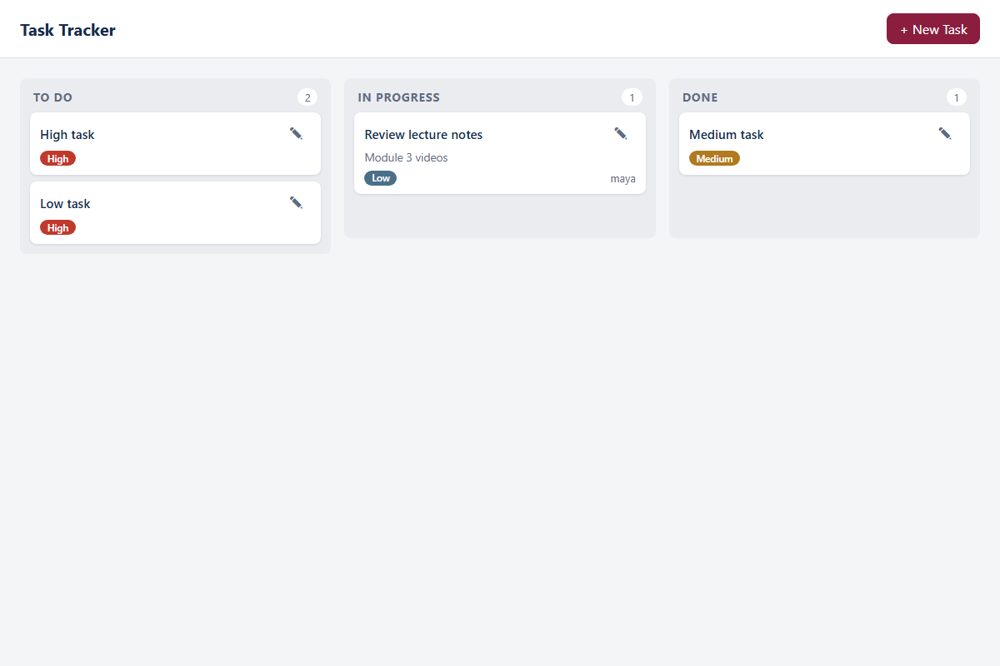

# Task Tracker — Modules 1–3

Task Tracker for the AI-Assisted Coding course. Module 1 built the FastAPI skeleton
with `/health`; Module 2 turned it into a working backend (strict Pydantic v2 models,
in-memory storage, five CRUD endpoints, status-transition rules, tested suite);
Module 3 added the browser frontend: a Kanban board with priority-sorted columns,
drag-and-drop status updates persisted through the API, and a create/edit modal with
client- and server-side validation. Still deliberately excluded: auth, real database,
deployment.



## Mid-course project (branch `mid-course-project`)

Two features added end-to-end with the course AI-assisted workflow:

1. **Due dates + overdue filter** — optional `due_date` (`YYYY-MM-DD`, null clears
   it on edit), a backend-computed `is_overdue` field, `GET /tasks?overdue=`,
   a due/overdue badge on cards, and an "Overdue only" board toggle.
2. **Tags / labels** — validated `tags` list (trimmed, non-empty, ≤10 × ≤30 chars,
   no duplicates), `GET /tasks?tag=`, comma-separated input in the modal, tag chips
   on cards, and a tag filter in the board's filter bar.

Documentation for the project (user stories, mini-ADR, prompt log, verification
evidence, reflection) lives in [`docs/midcourse/`](docs/midcourse/).

## Module 4 (branch `module-4`): delivery layer

- **CI** — [`.github/workflows/ci.yml`](.github/workflows/ci.yml) runs the pytest
  suite on every push and pull request (Python 3.14 pinned, no failure-swallowing
  flags). Proven green → red → green; evidence in
  [`docs/module4/ci-evidence.md`](docs/module4/ci-evidence.md).
- **Docker** — multi-stage [`Dockerfile`](Dockerfile) (slim base, non-root `app`
  user, runtime deps only) plus [`.dockerignore`](.dockerignore); see
  [`docs/module4/docker-security-log.md`](docs/module4/docker-security-log.md).
- **Project memory** — [`CLAUDE.md`](CLAUDE.md) for terminal-agent sessions.
- **Decision note** — [In-memory dict as the task storage layer](docs/decisions/in-memory-storage.md).
- **Evidence logs** — setup verification, claim-vs-reality documentation audit,
  AI review triage, and tool-fit reflection in [`docs/module4/`](docs/module4/).

## Project structure

```
app/
  main.py            # FastAPI app + five CRUD routes (PATCH enforces transitions)
  models.py          # Pydantic v2 models, TaskStatus/TaskPriority enums, validators
  storage.py         # in-memory storage helpers (add/get/update/delete/_reset)
  business_rules.py  # VALID_TRANSITIONS + validate_status_transition
  api/routes/        # health router
  core/              # configuration
frontend/
  index.html         # Kanban board page + create/edit modal markup
  css/styles.css
  js/api.js          # fetch layer — the only module that talks to the backend
  js/board.js        # column/card rendering, UI states, drag-and-drop
  js/modal.js        # create/edit form, client validation, 422 handling
  js/main.js         # entry point wiring board + modal
tests/
  verify_a.py        # Module 2 Verification A (8 model checks)
  verify_frontend.py # Module 3 executable behavior contract (headless Chromium)
  conftest.py        # TestClient, autouse storage reset, created_task fixtures
  test_tasks.py      # CRUD, validation, transition, delete, PATCH edge cases
  test_health.py
docs/                # user stories, ADR, behavior contract, debugging + other logs
```

## API

| Method | Path | Success | Errors |
|---|---|---|---|
| POST | `/tasks` | 201 + task | 422 invalid body |
| GET | `/tasks?status=&priority=&overdue=&tag=` | 200 + list (possibly `[]`) | 422 invalid filter value |
| GET | `/tasks/{id}` | 200 + task | 404 missing |
| PATCH | `/tasks/{id}` | 200 + task | 404 missing, 422 invalid payload/transition |
| DELETE | `/tasks/{id}` | 204, empty body | 404 missing |
| GET | `/health` | 200 | — |

Status transitions (enforced in the backend): `ToDo → InProgress`,
`InProgress → Done`, `Done → InProgress`. Everything else — including
same-status no-ops — returns 422.

## Setup and run

Prerequisites: Python 3.14, and Docker only if you want the container path.

```bash
python -m venv venv
venv\Scripts\activate            # Windows
# source venv/bin/activate       # macOS / Linux
pip install -r requirements-dev.txt   # runtime + test deps
python -m playwright install chromium # once, only for the browser contract
uvicorn app.main:app --reload --port 8000
```

`requirements.txt` alone is the runtime set (FastAPI + Uvicorn) — it is what the
Docker image installs; `requirements-dev.txt` adds pytest, httpx2, and Playwright.

Swagger docs: http://localhost:8000/docs

To run the frontend, serve `frontend/` on port 5500 (CORS is configured for it)
in a second terminal, with the backend running on port 8000:

```bash
python -m http.server 5500 --directory frontend
# open http://localhost:5500
```

## Run with Docker (backend only)

```bash
docker build -t task-tracker:dev .
docker run --rm -d -p 8000:8000 --name tt-dev task-tracker:dev
curl -i http://localhost:8000/health
docker exec tt-dev whoami   # expected: app (not root)
docker stop tt-dev
```

The image contains only `app/` and the runtime dependencies; storage is in-memory,
so a container restart starts with an empty board.

## CI

GitHub Actions ([`ci.yml`](.github/workflows/ci.yml)) runs `pytest tests/ -v` on
Python 3.14 for every push and pull request. A failing test fails the workflow —
this was proven by an intentional red run, not assumed.

## Verification

```bash
python -m tests.verify_a         # 8 model checks, all PASS
pytest tests/ -v                 # full backend suite (49 tests)
python -m tests.verify_frontend  # 19 browser contract checks (needs both servers
                                 # running and playwright chromium installed)
```

## Project conventions and current limitations

Backend owns all business rules (the UI never re-implements them); PATCH sends
only changed fields; tests must fail when the behavior they protect is broken
(Break Tests). Limitations by design: no auth, no database (tasks reset on
restart), no deployment automation — see the
[decision note](docs/decisions/in-memory-storage.md).
